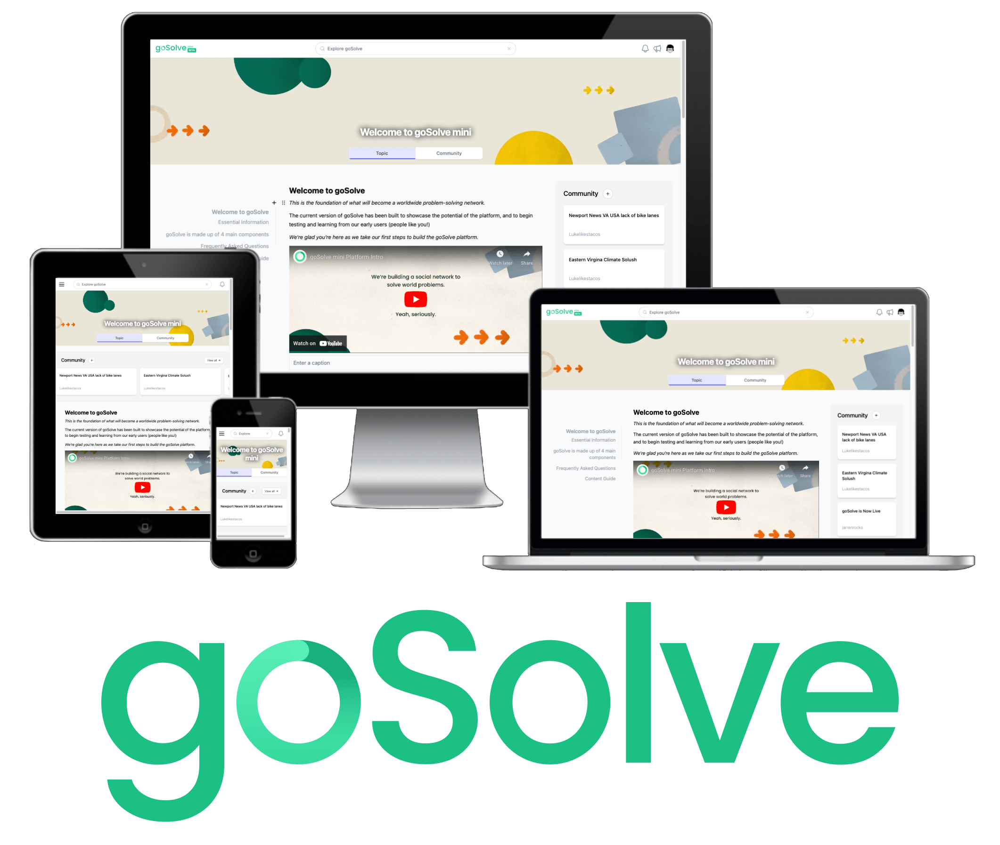
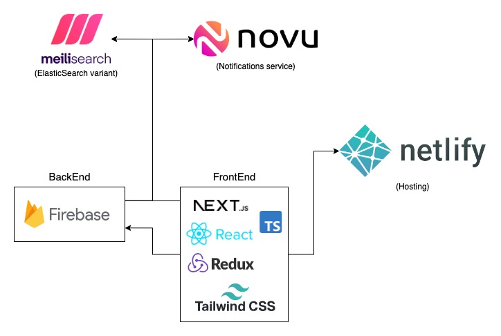

<p align="center">
  
</p>
<p align="center">
  <a href="https://github.com/gosolve-org/gosolve-mini/actions/workflows/deploy-main.yml?query=branch:main" target="_blank">
    
  </a>
  <a href="https://discord.gg/tKuFNHp5Ra" target="_blank">
    
  </a>
</p>

---
Connect and strategize with people in your community.  
goSolve is a space to solve world problems.  
  
<sub>This is a [Next.js](https://nextjs.org/) project with [Tailwind](https://tailwindcss.com/) and [Firebase](https://firebase.google.com/).</sub>  

## Project structure
<p align="center">
  
</p>

## First-time setup
```bash
# Installing NPM packages
npm install
(cd firebase/functions/ && npm install)

# Setting up Firebase
firebase login # Log in with your google account that has access to the dev firebase project
(cd firebase/ && firebase use default)
(cd firebase/ && firebase init emulators) # Select Authentication Emulator, Functions Emulator and Firestore Emulator
(cd firebase/ && cp -r exported-dev-data.example exported-dev-data) # Copy basic dummy data required for your emulators

# Setting up environment variables
# These will need to be filled in, ask a team member for the correct values.
# Don't fill in NEXT_PUBLIC_FIREBASE_MEASURMENT_ID for local development, since we don't want to track analytics locally.
cp .env-example .env
(cd firebase/functions/ && cp .env-example .env)
```

## Running firebase emulators
You can connect to either the actual firebase dev app or to your local emulators. It is recommended to use emulators during development:
```bash
cd firebase
npm run dev
```

## Running the front-end
Run the development server:
```bash
cd web
npm run dev
```
Open [http://localhost:3000](http://localhost:3000) with your browser to see the result.

## Folder structure
```
|── external // External libraries, packages or code that has been forked
|── firebase // Contains all firebase configurations
│   ├── functions // Contains all cloud functions
|── public // Contains all public resources for the Front-end app
|── src // Contains all source code for the Front-end app
│   ├── features // Contains all features of the app
│   |   ├── Notifications // All notifications related code (components, types, contexts, ...)
│   |   ├── ...
│   ├── common // Common components, models, contexts, ... used throughout app
│   ├── pages // Pages with folder structure to follow URL
│   │   ├── api // API functionality
│   ├── utils // Utility tools
```

## Initial Firebase project setup
- Create Firebase project
- Go to Cloud Firestore -> Create (in production mode)
- Go to Functions -> Get started (until you see the empty Dashboard)
- Go to Project Settings -> Set "Default GCP resource location"
- Go to https://console.cloud.google.com/artifacts and enable the Artifact API for your project
- Go to https://console.cloud.google.com/apis/library/cloudbuild.googleapis.com and enable the Cloud Build API for your project

## Continuous Deployment
We don't manually make changes or manually deploy to Firebase or Netlify. The following setup is used for automatic deployments.

### Front-end
This repository is linked to our Netlify:
- All changes to develop are automatically published to dev
- All changes to master trigger a build for staging & production, but need to be manually published

All environment variables & secrets needed for the front-end are stored in Netlify.

### Firebase
The Firebase functions, Firestore rules and indexes are deployed using GitHub Actions in this repository:
- All changes to develop are automatically deployed to dev
- All changes to master trigger a workflow for staging, which requires an approval. Afterwards, this workflow can be promoted to production.

#### Creating a service account for the firebase project
You need a service account json for executing the firebase actions (env variable: GCP_SA_KEY).
Go to Firebase => Project Settings => Service accounts => Manage service account permissions
Then create a new service account and grant the following roles:
- Service Account User
- Cloud Functions Admin
- Cloud Scheduler Admin
- Secret Manager Viewer
- Firebase Rules Admin
- Cloud Datastore Index Admin
- Artifact Registry Administrator
- Viewer

Create a json key for this service account, base64 encode it, and save it in the GCP_SA_KEY secret in the correct GitHub environment secret.

## Firebase notes (not relevant for local setup)
-   Setting up a new database requires going through the authentication and firestore database setups
    -   For authorization, add authorized domains under authentication -> settings
    -   Add env variables to deploy/local which can be found in project settings -> general -> your apps (search for `process.env` to see which ones are needed)

## License
[](https://www.gnu.org/licenses/agpl-3.0)  
goSolve is open-source. We use the [GNU AGPLv3 licensing strategy](LICENSE).
